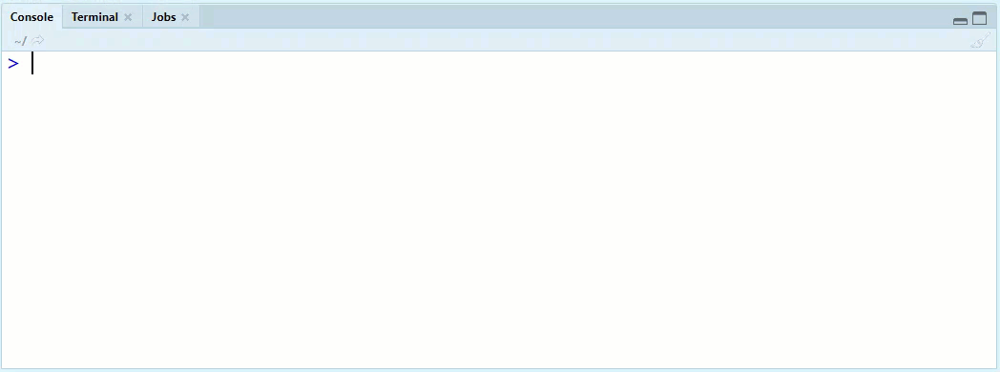

<!-- README.md is generated from README.Rmd. Please edit that file -->

# Bibliometri for latsabber

Dette er kursmateriale for kurset Bibliometri for latsabber. Her finner
du interaktive øvingsoppgaver og bakgrunnsmateriale, og etter hvert
lenker til kursvideoer.

## Hvordan bruke dette?

Den enkleste måten å komme igang med kurset er å åpne kursmappa i
RStudio og så trykke ‘Run Document’. Alt du trenger å gjøre er å kjøre
følgende, og så følge instruksjonene:

``` r
install.packages("learnr")
usethis::use_course("henrikkarlstrom/latsabber")
```

Dette skjer:



Dette åpner et nytt prosjekt i RStudio. Du finner kursmodulen du
(kanskje) er interessert i Files-panelet i RStudio, under inst \>
tutorials \> modul\[nummer\] \> modul\[nummer\].Rmd. Åpne denne fila, og
trykk “Run Document” på toppen, og kurset vil starte opp. Jeg anbefaler
å også trykke på “Run in Browser” når kurset åpner, men her er det
fritt valg…
