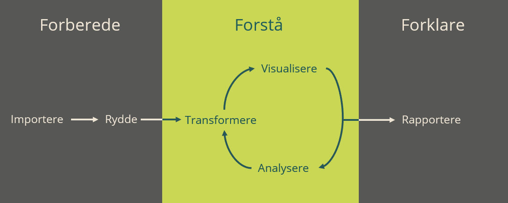
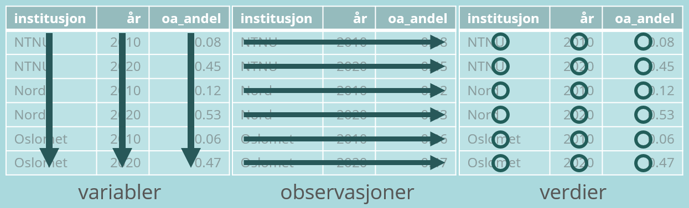
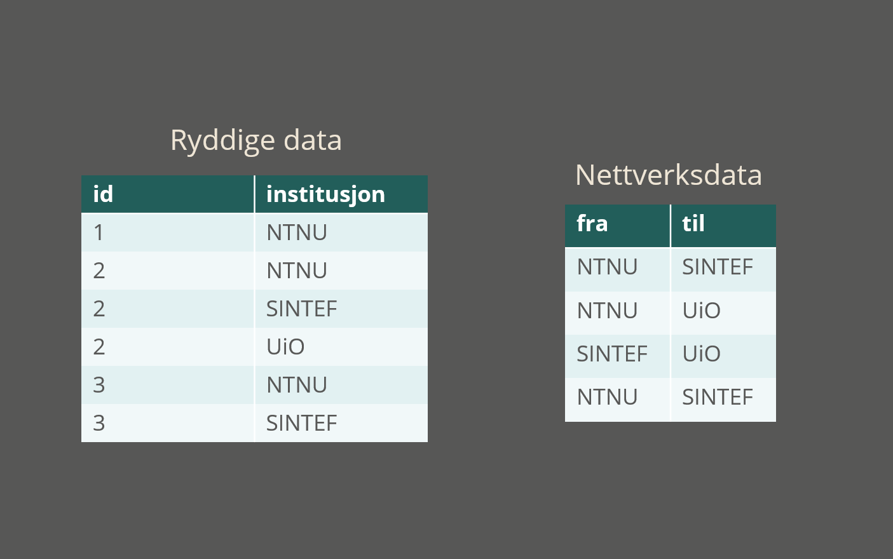
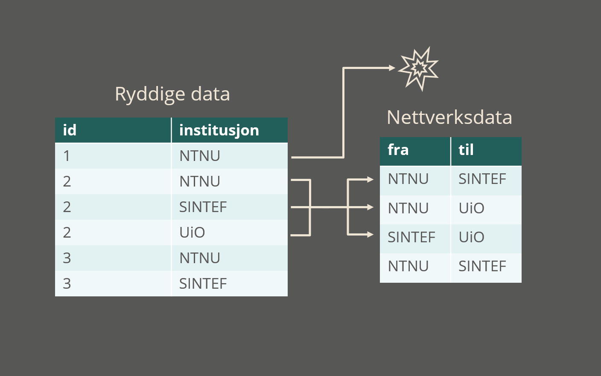
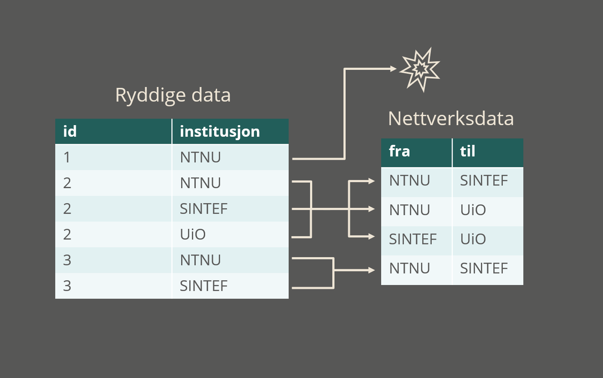

```{r setup, include = FALSE}
knitr::opts_chunk$set(echo = TRUE)
library(tidyverse)
library(visNetwork)
library(gt)

uryddig_tabell <- tibble(
  Journal = c(
    "Total for all journals",
    "Stature",
    "Hell",
    "Chemical Renews",
    "The Flancet",
    "Predatory Abstracts"
    ),
  total = c(
    44197, 11284, 10394, 4819,  7721, 9979
  ),
  jan_2019 = c(
    2883, 160, 877, 631, 950, 265
    ),
  feb_2019 = c(
    3077, 883, 517, 834, 781, 62
    ),
  mar_2019 = c(
    30501, 9283, 6295, 737, 5196, 8990
    ),
  apr_2019 = c(
    7736, 958, 2705, 2617,  794,  662
    )
  )

nodes <- readRDS("nodes.rds") %>%
  mutate(value = value * 1.8)
edges <- readRDS("edges.rds")
```

class: inverse, middle, right

> "Jeg vil i fullt alvor hevde at det gjøres en hel del skade i vår tid ved troen på det moralsk høyverdige ved ARBEID." 
>
> Bertrand Russell, *Til lediggangens lov*

---

class: center, middle

## Ryddige data, ryddige prosesser

---

## Datafag i et nøtteskall



---

## `tidyverse`

--

1. `readr::` for innlesing

--

1. `tidyr::` for vask og rydding

--

1. `dplyr::` for manipulasjon

--

1. `ggplot2::` for visualisering

--

### ...også pakker for modellering og funksjonell programmering

--

### Modulært bygd opp, og utvides stadig

---

## Ryddige data

--

### Hver variabel er en kolonne

--

### Hver observasjon er en rad

--

### Hver verdi er en celle

--



---

## Uryddige data

```{r, echo = FALSE}
uryddig_tabell %>%
  gt() %>%
  tab_header(
    title = "Journal Report 1 (R4)"
  ) %>%
  tab_style(
    style = cell_text(weight = "bold"),
    locations = cells_column_labels(1:6)
  ) %>%
  cols_label(
    total = "Reporting Period Total"
  ) %>%
  tab_options(
    table.width = 600,
    table.font.color = "#eee5d5",
    table.background.color = "#575756",
    table.font.size = "0.9em",
    table.border.bottom.color = "#eee5d5",
    table.border.top.color = "#eee5d5",
    table_body.hlines.style = "none"
  ) %>%
  as_raw_html()
```

---

## Uryddige data

```{r, echo = FALSE}
uryddig_tabell %>%
  gt() %>%
  tab_header(
    title = "Journal Report 1 (R4)"
  ) %>%
  tab_style(
    style = cell_text(weight = "bold"),
    locations = cells_column_labels(1:6)
  ) %>%
  tab_style(
    style = cell_fill(color = "#c9d755"),
    locations = cells_column_labels(3:6)
  ) %>%
  tab_style(
    style = cell_text(color = "#575756"),
    locations = cells_column_labels(3:6)
  ) %>%
  cols_label(
    total = "Reporting Period Total"
  ) %>%
  tab_options(
    table.width = 600,
    table.font.color = "#eee5d5",
    table.background.color = "#575756",
    table.font.size = "0.9em",
    table.border.bottom.color = "#eee5d5",
    table.border.top.color = "#eee5d5",
    table_body.hlines.style = "none"
  ) %>%
  as_raw_html()
```

---

## Uryddige data

```{r, echo = FALSE}
uryddig_tabell %>%
  gt() %>%
  tab_header(
    title = "Journal Report 1 (R4)"
  ) %>%
  tab_style(
    style = cell_text(weight = "bold"),
    locations = cells_column_labels(1:6)
  ) %>%
  tab_style(
    style = cell_fill(color = "#c9d755"),
    locations = cells_body(
      columns = 1:6,
      rows = 1)
  ) %>%
  tab_style(
    style = cell_text(color = "#575756"),
    locations = cells_body(
      columns = 1:6,
      rows = 1)
  ) %>%
  cols_label(
    total = "Reporting Period Total"
  ) %>%
  tab_options(
    table.width = 600,
    table.font.color = "#eee5d5",
    table.background.color = "#575756",
    table.font.size = "0.9em",
    table.border.bottom.color = "#eee5d5",
    table.border.top.color = "#eee5d5",
    table_body.hlines.style = "none"
  ) %>%
  as_raw_html()
```

---

## Uryddige data

```{r, echo = FALSE}
uryddig_tabell %>%
  gt() %>%
  tab_header(
    title = "Journal Report 1 (R4)"
  ) %>%
  tab_style(
    style = cell_text(weight = "bold"),
    locations = cells_column_labels(1:6)
  ) %>%
  tab_style(
    style = cell_fill(color = "#c9d755"),
    locations = cells_body(
      columns = 2
      )
  ) %>%
  tab_style(
    style = cell_text(color = "#575756"),
    locations = cells_body(
      columns = 2,
      )
  ) %>%
  tab_style(
    style = cell_fill(color = "#c9d755"),
    locations = cells_column_labels(2)
  ) %>%
  tab_style(
    style = cell_text(color = "#575756"),
    locations = cells_column_labels(2)
  ) %>%
  cols_label(
    total = "Reporting Period Total"
  ) %>%
  tab_options(
    table.width = 600,
    table.font.color = "#eee5d5",
    table.background.color = "#575756",
    table.font.size = "0.9em",
    table.border.bottom.color = "#eee5d5",
    table.border.top.color = "#eee5d5",
    table_body.hlines.style = "none"
  ) %>%
  as_raw_html()
```

---

## Ryddige data

```{r, echo = FALSE}
uryddig_tabell %>%
  select(-total) %>%
  filter(Journal != "Total for all journals") %>%
  pivot_longer(
    cols = c(jan_2019:apr_2019),
    names_sep = "_",
    names_to = c("Month", "Year"),
    values_to = "Downloads"
    ) %>%
  gt() %>%
  tab_style(
    style = cell_text(weight = "bold"),
    locations = cells_column_labels(1:4)
  ) %>%
  tab_options(
    table.width = 600,
    table.font.color = "#eee5d5",
    table.background.color = "#575756",
    table.font.size = "0.7em",
    data_row.padding = px(2.5),
    table.border.bottom.color = "#eee5d5",
    table.border.top.color = "#eee5d5",
    table_body.hlines.style = "none"
  ) %>%
  as_raw_html()

```


---

class: inverse, middle, right

## Ryddige data som standard

---

class: inverse, middle, right

> "Jeg setter alltid en lat person til å gjøre en vrien jobb, for den late vil finne en enkel måte å gjøre den på."
>
> Frank B. Gilbreth, Sr, *Popular Science Monthly*

---

## Utgangspunkt, ikke endestasjon 

--

### Ryddige data er en plattform

Konsistent format = konsistent transformasjon = effektivitet

--

### Energi brukes på forståelse

Vi liker innsikt bedre enn programmering

--

### La andre gjøre det vanskelige

Bare gi dem det de vil ha...

---

## Eksempel: Nettverksdata



---

## Eksempel: Nettverksdata


---

## Eksempel: Nettverksdata



---

## Eksempel: Nettverksdata



---

class: center

## Sampublisering NTNU 2020
```{r, echo = FALSE}
visNetwork(
  edges = edges,
  nodes = nodes,
  background = "#575756"
  ) %>%
  visNodes(
    font = list(
      color = "#eee5d5",
      size = 26,
      face = "Open Sans"
    )
  ) %>%
  visGroups(
    groupname = "main",
    color = "#c9d755",
    shape = "square"
  ) %>%
  visGroups(
    groupname = "collab",
    color = "#aad9dd"
  ) %>%
  visOptions(
    width = "800px",
    height = "600px",
    highlightNearest = list(
      enabled = TRUE, 
      degree = 1, 
      hover = TRUE
    )
  )
```
