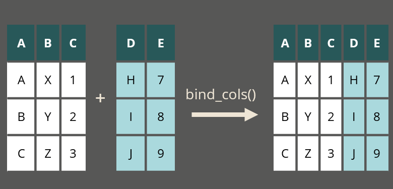

```{r setup, include = FALSE}
knitr::opts_chunk$set(echo = TRUE)
```

class: inverse, middle, right

> "It's true that hard work never killed anybody, 
> but I figure why take the chance" 
> 
> Ronald Wilson Reagan

---

class: inverse, center, middle

# Slå sammen datasett

---

## Enkel liming: `bind_rows()`


---

## Enkel liming: `bind_rows()`


---

## Enkel liming: `bind_rows()`


---

## Enkel liming: `bind_cols()`


---

## Enkel liming: `bind_cols()`


---

## Enkel liming: `bind_cols()`



---

## Berike et datasett: `left_join()`


---

## Berike et datasett: `left_join()`


---

## Berike et datasett: `left_join()`


