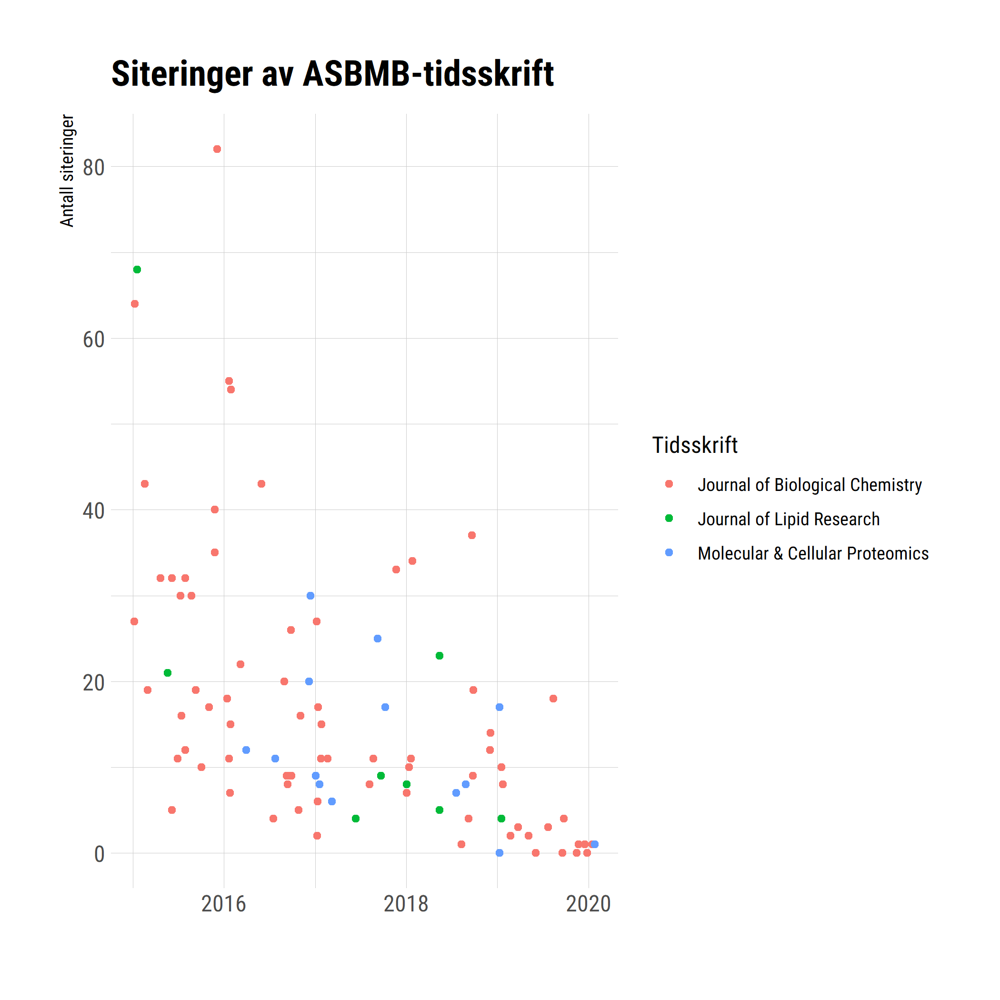

```{r setup, include = FALSE}
knitr::opts_chunk$set(echo = TRUE)
library(tidyverse)
library(latsabber)
library(hrbrthemes)

plotdata <- asbmb_pubs %>%
  filter(url_type == "DOI") %>%
  mutate(
    doi = tolower(str_remove(link_url, "^^.*?(?=\\d)")),
    date = lubridate::date(created.date)
    ) %>%
  left_join(citations, by = "doi") %>%
  mutate(
    times_cited = replace_na(times_cited, 0)
    )
```


class: inverse, center, middle

# Grafikkens grammatikk

---

## Grafer er lagkaker


---

## Grafer er lagkaker


---

## Grafer er lagkaker


---

## Grafer er lagkaker


---

## Grafer er lagkaker


---

## Grafer er lagkaker


---

## Grafer er lagkaker


---

## Grafer er lagkaker


---

## `ggplot()` gjør mye av jobben


---

```{r, echo = FALSE, out.height=600, out.width=680}

```

---

```{r, echo = FALSE, out.height=600, out.width=680}

```

---

```{r, echo = FALSE, out.height=600, out.width=680}

```

---

```{r, echo = FALSE, out.height=600, out.width=680}

```

---


```{r, echo = FALSE, out.height=600, out.width=680}

```

---

```{r, echo = FALSE, out.height=600, out.width=680}

```
---

```{r, echo = FALSE, out.height=600, out.width=680}

```
---

```{r, echo = FALSE, out.height=600, out.width=680}

```

---

```{r, echo = FALSE, out.height=600, out.width=680}

```
---

```{r, echo = FALSE, out.height=600, out.width=680}

```
---

```{r, echo = FALSE, out.height=600, out.width=680}

```
---

```{r, echo = FALSE, out.height=600, out.width=680}
knitr::include_graphics("images/flyt12.png")
```

---
.pull-left[
```{r, echo = TRUE, eval = FALSE}
plotdata %>%
  ggplot()
```
]
.pull-right[
```{r, echo = FALSE}
plotdata %>%
  ggplot()
```
]
---
.pull-left[
```{r, echo = TRUE, eval = FALSE}
plotdata %>%
  ggplot(
    mapping = aes(
      x = date,
      y = times_cited,
      color = journal.name
      )
    )
```
]
.pull-right[
```{r, echo = FALSE}
plotdata %>%
  ggplot(
    mapping = aes(
      x = date,
      y = times_cited,
      color = journal.name
      )
    )
```
]
---
.pull-left[
```{r, echo = TRUE, eval = FALSE}
plotdata %>%
  ggplot(
    mapping = aes(
      x = date,
      y = times_cited,
      color = journal.name
      )
    ) +
  geom_point()
```
]
.pull-right[
```{r, echo = FALSE}
plotdata %>%
  ggplot(
    mapping = aes(
      x = date,
      y = times_cited,
      color = journal.name
      )
    ) +
  geom_point()
```
]
---

.pull-left[
```{r, echo = TRUE, eval = FALSE}
plotdata %>%
  ggplot(
    mapping = aes(
      x = date,
      y = times_cited,
      color = journal.name
      )
    ) +
  geom_point() +
  labs(
    title = "Siteringer av ASBMB-tidsskrift",
    x = "",
    y = "Antall siteringer",
    color = "Tidsskrift"
    )
```
]
.pull-right[
```{r, echo = FALSE}
plotdata %>%
  ggplot(
    mapping = aes(
      x = date,
      y = times_cited,
      color = journal.name
      )
    ) +
  geom_point() +
  labs(
    title = "Siteringer av ASBMB-tidsskrift",
    x = "",
    y = "Antall siteringer",
    color = "Tidsskrift"
    )
```
]
---

.pull-left[
```{r, echo = TRUE, eval = FALSE}
plotdata %>%
  ggplot(
    mapping = aes(
      x = date,
      y = times_cited,
      color = journal.name
      )
    ) +
  geom_point() +
  labs(
    title = "Siteringer av ASBMB-tidsskrift",
    x = "",
    y = "Antall siteringer",
    color = "Tidsskrift"
    ) +
  theme_ipsum_rc()
```
]
.pull-right[
```{r, echo = FALSE}
plotdata %>%
  ggplot(
    mapping = aes(
      x = date,
      y = times_cited,
      color = journal.name
      )
    ) +
  geom_point() +
  labs(
    title = "Siteringer av ASBMB-tidsskrift",
    x = "",
    y = "Antall siteringer",
    color = "Tidsskrift"
    ) +
  theme_ipsum_rc()
```
]
---
```{r, echo = FALSE, out.height=600, out.width=680}

```
---

```{r, echo = FALSE, out.height=600, out.width=680}

```

---

```{r, echo = FALSE, out.height=500, out.width=800}

```

---

```{r, echo = FALSE, out.height=600, out.width=600}
knitr::include_graphics("images/quspin.png")
```

---