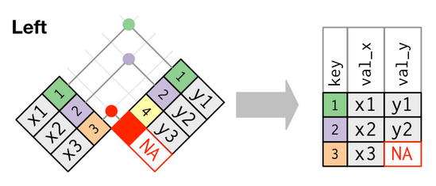
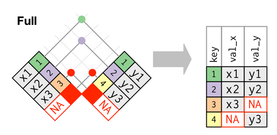

```{r setup, include=FALSE}
library(learnr)
knitr::opts_chunk$set(echo = FALSE)
tutorial_options(
  exercise.cap = "Kode",
  exercise.startover = FALSE,
  exercise.lines = 5
)

library(tidyverse)
library(latsabber)
```

## 

{width=800px}

## Jobbe med flere datasett

Det er sjelden det vi er interessert i å finne ut befinner seg i ett enkelt, ryddig datasett. I stedet må vi kanskje gå til flere kilder etter data for å kunne svare på spørsmål vi måtte ha.

I denne modulen skal vi se nærmere på verbene som gjør det mulig å sammenstille datasett basert på delte variabler eller felles dimensjoner.


## Lime sammen datasett

Den minst kompliserte måten å slå sammen to datasett på er hvis de inneholder enten de samme variablene (altså har samme kolonner) eller har variabler av samme lengde (altså har like mange rader) - da trenger vi ikke gjøre annet enn å lime fast den ene tabellen på den andre. Til det bruker vi ett av `bind_`-verbene, som opererer på enten rader eller kolonner.


### Lage flere rader: `bind_rows()`

Det er ikke uvanlig at data kommer som tabeller med likelydende kolonner men forskjellige rader. Et eksempel kan være statistikk utformet i forbindelse med årsrapportering, hvor man rapporterer på de samme indikatorene hvert år, men med forskjellige verdier. For å få et komplett datasett som muliggjør for eksempel analyse av utvikling over tid fungerer det fint å ganske enkelt lime inn alle tabellene under hverandre.

I `dplyr::` fins funksjonen `bind_rows()` for å gjøre dette. Den gjør to ting:

1. Limer inn radene fra en eller flere tabeller i en annen basert på kolonnenavn
2. Fyller inn R sin tomme verdi `NA` der en eller flere tabeller mangler den aktuelle kolonnen.

I tillegg til tabellnavnene du gir den har du mulighet til å spesifisere om det skal lages en ny kolonne som indikerer opphavstabellen du limer sammen. Dette kan være nyttig hvis du ønsker å gjøre en analyse som avhenger av forskjellen mellom tabellene, og gjøres med `.id`-argumentet i funksjonen. 

`bind_rows()` tar som argumenter de tabellene du vil lime sammen:

```{r, echo = TRUE}
bind_rows(henrik, hvl)
```

Og sånn ser det ut om vi vil ha en kolonne som beholder informasjonen om hvilke tabeller vi hentet data fra:

```{r, echo = TRUE}
data <- list(henrik = henrik, hvl = hvl)

bind_rows(data, .id = "hvem")
```

### Lage flere kolonner: `bind_cols()`

Denne funksjonen gjør det samme som `bind_rows()`, men med kolonner. Her trengs ingen felles navn eller noe slikt, men det er umulig å binde kolonner som ikke er like lange.


## Felles variabler

Det er hyggelig når man kan slå sammen tabeller så enkelt som over, men ofte er vi heller interessert i å utforske relasjonene mellom distinkte datasett som deler en eller flere variabler. Til dette bruker vi `join`-familien av funksjoner.

Det er i hovedsak tre måter å slå sammen tabeller på:

1. Du ønsker bare å beholde de radene som er til stede i begge tabellene
2. Du ønsker å berike én tabell med data fra en annen tabell
3. Du vil ha rubbel og bit fra begge tabeller

Alle funksjonene har samme syntaks: de trenger to tabeller som skal slås sammen (med `x` og `y`-argumentene), og hvilke kolonner som skal sammenlignes på (med `by`-argumentet).

Her er et eksempel som slår opp verdiene fra en kolonne i tabell `A` i tilsvarende kolonne i tabell `B`:

```{r, echo = TRUE}
# lager noen fiktive tabeller
A <- tibble(
  cristin_id = c(
    1051802, 1051805, 1051809, 1051815, 1052286
    ),
  år = c(2013, 2016, 2015, 2020, 2013)
  )

B <- tibble(
  cristin_id = c(
    1051802, 1051805, 1051809, 1052286, 007
    ),
  tidsskriftavslag = c(0, 4, 6, 8, 10)
)

# selve sammenslåingsfunksjonen
left_join(
  x = A, 
  y = B,
  by = "cristin_id"
  )
```


### Behold det felles: `inner_join()`

Denne operasjonen sjekker verdiene i nøkkelkolonnen i de to datasettene, og gir tilbake bare de radene som er til stede i begge sett. Grafisk kan det fremstilles som dette (alle disse illustrasjonene er fra [Grolemund og Wickham](https://r4ds.had.co.nz/) (2017), CC-BY-NC-ND 3.0):


Nøkkelkolonnene sjekkes, og siden bare verdiene 1 og 2 er til stede i begge sett får vi tilbake en tabell med to rader og en kolonne fra hvert sett.

Med eksempelet over:

```{r, echo = TRUE}
inner_join(
  x = A,
  y = B,
  by = "cristin_id"
  )
```


### Berik ett sett: `left_join()`

Venstre- og høyresammenslåing (`left_join()` og `right_join()` gjør det samme, men med forskjellig tabell som måltabell) er kanskje den vanligste typen - du har en tabell med en id-kolonne i, og ønsker å slå opp verdier i en annen tabell som har samme id-verdier. Det som gjør denne så nyttig er at den beholder den opprinnelige tabellen som den var og legger til de verdier den finner i den andre tabellen. Der den ikke finner en verdi får du en tom `NA`.

Diagrammatisk ser det sånn ut:



Verdiene fra `y` som svarer til 1 og 2 i nøkkelkolonnen blir lagt til `x`, og verdi 3, som mangler i `y`, blir til `NA` i den oppdaterte tabellen.

La oss gjenta eksempelet fra over:

```{r, echo = TRUE}
left_join(
  x = A, 
  y = B,
  by = "cristin_id"
  )
```


### Ta med alle rader: `full_join()`

Denne tar med alle rader fra begge tabeller, som dette:



Her fyller funksjonen bare inn med `NA` der det er verdier som mangler i en av tabellene.

```{r, echo = TRUE}
full_join(
  x = A,
  y = B,
  by = "cristin_id"
  )
```


## Spesialtilfeller

Dette bør dekke den vanligste bruken av sammenslåinger, men det fins selvfølgelig mange situasjoner hvor det å skulle bruke disse funksjonene kan være krøkkete. Et eksempel er der hvor man skal gjøre mange sammenslåinger på rad


### Dupliserte rader

Det er ofte ikke sånn at verdiene i en id-kolonne er unike. Som vi vet kan ryddige data ha mange dupliserte verdier, så lenge kombinasjonen av variabelverdier er unik per rad. Dette er ikke et problem, fordi en typisk venstresammenslåing beholder den ryddige strukturen i den opprinnelige tabellen:


Den nye tabellen har beholdt strukturen til tabell `x`, og duplisert verdiene fra tabell `y`.


### Filtrere med sammenslåinger

Noen ganger er du bare interessert i de radene som også fins i en annen tabell. Det er alltid mulig å bruke en vanlig venstresammenslåing og så filtrere ut kolonner du ikke er interessert i senere, men det går også an å bruke en såkalt filtrerende sammenslåing. For å beholde bare de kolonnene i `x` som har rader som også fins i `y` (men ikke omvendt), kan du bruke `semi_join()`:


Dette er altså en effektiv måte å filtrere en tabell på verdier i en annen tabell. 

Det motsatte er selvfølgelig også mulig, til det bruker vi `anti_join()`:


En antisammenslåing kan være nyttig når du skal sjekke hvilker verdier i en tabell som *mangler* i en annen tabell.