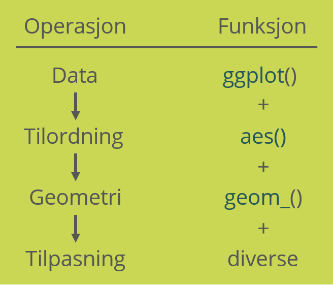
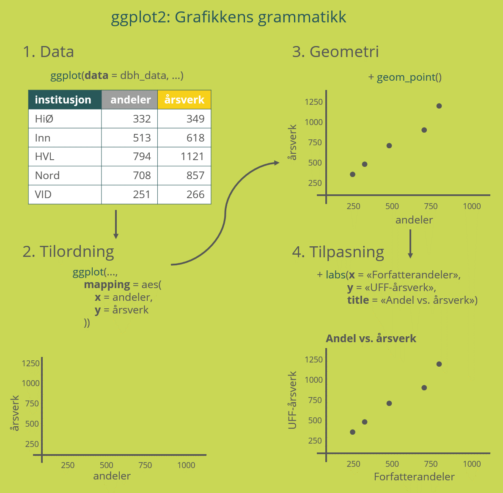

```{r setup, include=FALSE}
library(learnr)
library(tidyverse)
library(latsabber)
library(hrbrthemes)

knitr::opts_chunk$set(echo = FALSE)
tutorial_options(
  exercise.cap = "Kode",
  exercise.startover = FALSE,
  exercise.lines = 5
)

plotdata <- asbmb_pubs %>%
  filter(url_type == "DOI") %>%
  mutate(
    doi = tolower(str_remove(link_url, "^^.*?(?=\\d)")),
    date = lubridate::date(created.date)
    ) %>%
  left_join(citations, by = "doi") %>%
  mutate(
    times_cited = replace_na(times_cited, 0)
    )
```

## 

{width=800px}

## En grammatikk for grafikk

Et av de viktigste verktøyene vi har for å gi mening til store mengder data er å visualisere det. Selv om det fins god oppsummerende statistikk på [Cristins nettsider](https://www.cristin.no/statistikk-og-rapporter/nvi-rapportering/index.html) er vi ofte interessert i se på egenskaper ved publikasjonene utover de ferdige kategoriene en standardrapport kan tilby oss. Norske forskere publiserer nesten tretti tusen vitenskapelige publikasjoner i året, og selv for mindre institusjoner er det snakk om en betydelig årlig produksjon. Over år kan det komme opp i tusenvis av pulikasjoner, og det kan fort bli overveldende å forsøke å forstå sammenhenger i tabeller med så mange rader. 

Visualisering handler om å oversette data til et geometrisk koordinatsystem som viser sammenhenger i dataene. Mange er kanskje ikke vant til å tenke på grafikk på denne måten, men (nesten) alle grafer har den samme underliggende strukturen: verdier tilordnes et visuelt element som plasseres på grafen etter en bestemt logikk. Denne tilordningen til elementer, og logikken for plassering av dem, følger faste regler, og det er dette som er grunnlaget for en *grafisk grammatikk*. Denne grammatikken er tema for modul 5.

### Maskiner liker regler
Mange visualiseringsverktøy skjuler måten denne grammatikken er bygd opp ved å legge stramme føringer på hvordan visualiseringen kan tilpasses, men i `tidyverse` er filosofien at du kan bestemme over absolutt alle aspekter ved det du ønsker å produsere. Det gjør visualisering i R ekstremt fleksibelt og kraftig, men betyr også at du må fortelle R helt spesifikt akkurat hvordan du vil ha ting.

Som med all programmering blir verdien av denne tenkningen i logikker og mengder virkelig verdifull når det er snakk om *mye* data som skal visualiseres, men etter hvert som visualiseringsflyten sitter bedre i fingrene vil du oppleve at veien fra data i en tabell til en produksjonsklar graf blir svært kort. I hvert fall til vi begynner å finpusse for å få ting til å se ut **akkurat** som vi vil, så klart...


## Grafikkens oppbygging

Den grafiske grammatikken består i hovedsak av fire operasjoner som du må fortelle R om:

1. Hvilke data skal visualiseres?
2. Hvordan skal dataene tilordnes et koordinatsystem?
3. Hva slags symboler skal representere dataene?
4. Er det noen ekstra estetiske og/eller visuelle tilpasninger som trengs for å gjøre grafen så forståelig som mulig?

`tidyverse` er som kjent en samling pakker, og pakken for å gjøre visualisering heter `ggplot2::`.
For hver av de fire operasjonene over fins det (selvfølgelig) `ggplot2::`-funksjoner som tar inn argumenter du spesifiserer, og sender resultatet videre til neste funksjon i rekken:



På denne måten bygger vi grafikken inkrementelt, og hver del av arbeidsflyten er en modul som kan endres for å raskt få et helt annet resultat om det skulle være ønskelig.

I tillegg er det mye tilleggsfunksjonalitet som det er nyttig å forstå for å kunne lage grafer som vi vil, men som ikke er strengt nødvendig for å kunne lage brukbare visualiseringer raskt. Her skal vi konsentrere oss om det absolutte minimum av verb som trengs for å lage visualiseringer.


## Hvordan bruker vi `ggplot2::`?

Som vi så over er det en fast flyt i hvordan vi lager grafikk i `ggplot2::`. Vi starter med data, legger til en tilordning til et koordinatsystem (og andre estetiske valg som skal kobles til verdier i datasettet), velger en symbolgeometri for plassering av verdiene, og avslutter med å tilpasse grafen for å gjøre den mest mulig informativ.

Superforenklet ser det ut som på denne grafikken. Her ser vi hvordan noen enkle data om produksjonen til fem institusjoner i 2019 kan visualiseres som et punktdiagram.

{width="800px"}

Vi skal se litt nærmere på de forskjellige elementene som utgjør grafikkens grammatikk.

### Første byggestein: `ggplot()`

Alle grafer begynner med å erklære at vi skal lage en graf, og det gjør vi med `ggplot()`. Denne funksjonen tar to argumenter, `data =` og `mapping =`, og oppretter et grafisk objekt som kan sendes til forskjellige geometrifunksjoner og andre tilpasninger. Ofte vil en visualisering komme på slutten av en serie datamanipuleringer, så typisk vil `data =`-argumentet ikke trengs å spesifiseres i det hele tatt.

### Tilordning: `aes()`

`ggplot()` gjør i seg selv nesten ingenting på overflaten. Dens eneste jobb er å opprette et plot-objekt som kan sendes videre til andre funksjoner, samt ta imot et tilordningsargument for å bestemme forholdet mellom variabler i datasettet og deres grafiske fremstilling.

Den viktigste argumentet gjøres gjennom `mapping = aes()`, hvor `aes()`-funksjonen spesifiserer hvilke elementer i datasettet som skal tilordnes hvilke aspekter i grafen. De desidert viktigste aspektene vil være hva som skal på y-aksen og x-aksen, men også ting som hvorvidt symbolene skal fargelegges eller gis annen form eller størrelse basert på verdier i en variabel.

### Geometri: `geom_()`

Når du har kalt `ggplot()` er det på tide å bestemme hvordan data skal representeres gjennom en bestemt geometri. Til det fins det en stor og voksende familie med funksjoner som tilordner verdier en spesifikk geometrisk representasjon av dataene dine. Det viktigste å huske på i denne sammenheng er:

1. Alle geometri-funksjonene begynner med `geom_`
2. Du legger til et geom med `+` etter `ggplot()`.

Akkurat hvilke argumenter som er viktige for å produsere hvilken geometri varierer veldig, så det er vanskelig å komme med generelle råd om hvordan hver enkelt skal brukes.

De vanligste geometriene for våre formål vil likevel typisk være stolper (`geom_col()`), punkter (`geom_point()`), linjer (`geom_line()`) eller en form for distribusjon (`geom_boxplot()`).

### Tilpasning: `labs()`, `theme_()`, `scale_()` osv.

Strengt tatt trenger du ikke mer enn `ggplot()`, `aes()` og `geom_()` for å produsere en graf. Det er likevel ofte hensiktsmessig å gjøre noen ytterligerer tilpasninger, for eksempel gjennom å gi akser mer informative navn, eller å gi grafen en forklarende tittel og undertittel.

Til slike formål fins det mange funksjoner for å endre på teksten i grafen (`labs()`), hvordan aksene er skalert (med `scale_()`-funksjonene) eller til og med det generelle utseendet på hele grafen med komplette tema (`theme_()`).

En komplett oversikt over alle formene for tilpasning som er innebygd i `ggplot2::` fins i [referansemanualen til pakken](https://ggplot2.tidyverse.org/reference/), som kan lede deg videre til oversikter over hvordan funksjonene brukes og hvilke argumenter de tar.

## Demonstrasjon: Steg for steg

La oss se hvordan dette ser ut i praksis, gjennom et eksempel som viser alle stegene i hvordan `ggplot2::` bygger opp grafikken sin. For at det skal være tydelig hva som foregår skriver vi mye mer kode enn det som er nødvendig. Til slutt vil du se det samme eksempelet skrevet på mer kompakt vis.

Det første vi gjør er alltid å starte plottingen med `ggplot()`:

```{r, echo = TRUE}
plotdata %>%
  ggplot()
```

Legg merke til at vi bruker `tidyverse`-konvensjonen med å starte med dataene og så sende de inn i funksjonen med `%>%` - derfor trenger vi ikke spesifisere data-argumentet i `ggplot()`. Som vi ser gjør dette ingenting annet enn å lage en grå boks - R vet ennå ikke hva den skal gjøre med dataene. La oss fortsette med å spesifisere hva som skal på x-aksen: 

```{r, echo = TRUE}
plotdata %>%
  ggplot() +
  aes(x = date)
```

Der kom det opp noen årstall. Og y-aksen?

```{r, echo = TRUE}
plotdata %>%
  ggplot() +
  aes(x = date) +
  aes(y = times_cited)
```

Legg merke til at `aes()` allerede har en ide om fornuftige minimums- og maksimumsverdier for aksene - den gjør jobben med å beregne disse for deg.

Nå er det på tide å fortelle hvilke symboler som skal representere dataene våre. I dette tilfellet er det snakk om forholdet mellom to numeriske verdier, og da er punkter gode symboler:

```{r, echo = TRUE}
plotdata %>%
  ggplot() +
  aes(x = date) +
  aes(y = times_cited) +
  geom_point()
```

Dette er jo data for tre forskjellige tidsskrift - det kunne vært fint å skille mellom punktene som tilhørte de forskjellige. Det gjør vi med et argument til til `aes()`, hvor vi tilordner punktene farge etter verdien i "journal"-kolonnen i datasettet: 

```{r, echo = TRUE}
plotdata %>%
  ggplot() +
  aes(x = date) +
  aes(y = times_cited) +
  geom_point() +
  aes(color = journal.name)
```

Nå er dataene tilordnet plassering, symbolikk og estetikk basert på verdiene i datasettet, og vi har det vi trenger for å begynne å forstå hva det er vi ser på. Av grafen kan vi avlese at det:

1. ikke overraskende er en generell nedadgående trend for siteringer jo kortere det er siden publikasjonen kom ut.
2. er langt flere norske publikasjoner i Journal of Biological Chemistry enn de andre.
3. JBC nok også blir hyppigere sitert enn de andre tidsskriftene.

Når det er sagt er det flere ting vi kan gjøre for å forbedre grafen litt. La oss legge til bedre navn på nøkkelen og y-aksen, fjerne den overflødige tidbenevnelsen på x-aksen, og gi grafen en tittel:

```{r, echo = TRUE}
plotdata %>%
  ggplot() +
  aes(x = date) +
  aes(y = times_cited) +
  geom_point() +
  aes(color = journal.name) +
  labs(
    title = "Siteringer av ASBMB-tidsskrift",
    x = "",
    y = "Antall siteringer",
    color = "Tidsskrift"
    )
```

Til slutt vil jeg gjøre noen generelle estetiske endringer. Det gjør vi med en `theme_()`-funksjon, som gjør helhetlige endringer for de forskjellige elementene til en graf - alt fra font til størrelse på akseteksten til valg av bakgrunnsfarge. Det er mange innebygde tema i `ggplot2::` (prøv for eksempel `theme_light()`), men ellers i dette kurset har jeg brukt et fra [hrbrthemes-pakken til Bob Rudis](https://cinc.rud.is/web/packages/hrbrthemes/), så da gjør vi det like godt her:

```{r, echo = TRUE}
plotdata %>%
  ggplot() +
  aes(x = date) +
  aes(y = times_cited) +
  geom_point() +
  aes(color = journal.name) +
  labs(
    title = "Siteringer av ASBMB-tidsskrift",
    x = "",
    y = "Antall siteringer",
    color = "Tidsskrift"
    ) +
  theme_ipsum_rc()
```

### Mer konsist, og bedre

Koden over ser kanskje litt mye ut bare for å produsere et enkelt punktdiagram, men siden alle grafer bygges opp på samme måte vil bevegelsen "data --> `ggplot()` --> `geom_()` --> diverse tilpasninger" etter hvert sitte i fingrene, og det å lage grafiske fremstillinger av data gå mye raskere enn å skulle gjøre masse pek-og-klikk-endringer på en graf. 

Husk også at dette var et uvanlig didaktisk eksempel. Vanligvis vil vi bare kalle hver funksjon én gang, så det fins mer konsise måter å produsere samme graf på:

```{r, echo = TRUE}
plotdata %>%
  ggplot(
    #aes() plasseres inn i ggplot()
    mapping = aes(
      x = date,
      y = times_cited,
      color = journal.name
      )
  ) +
  geom_point() +
  labs(
    title = "Siteringer av ASBMB-tidsskrift",
    x = "",
    y = "Antall siteringer",
    color = "Tidsskrift"
    ) +
  theme_ipsum_rc()
```

## Varianter

En av fordelene med å ha en klart definert grammatikk for grafiske elementer er at det muliggjør tilpasninger av akkurat de grafiske elementene vi er interessert i å fremheve. Det bygges stadig nye pakker som tilbyr egne geometrier eller ting som animasjoner og avanserte annotasjoner. Vi skal ikke gå inn på alle mulighetene her, men det kan jo være morsomt å vise frem en av de aller nyttigste tingene som faktisk er bygd inn i `ggplot2::`, nemlig fasettering.

### Fasetter
I grafen valgte vi å synliggjøre tidsskriftene med bruk av farge. Det er ikke alltid hensiktsmessig, spesielt ikke når det er flere enn to-tre kategorier som skal skilles. Det fins andre måter å gjøre det på, og en populær metode er å skille ut elementene i hver sine mini-diagrammer i stedet for å ha alle punktene (eller linjene, eller søylene, eller hvilken geometri du har valgt) på samme flate. Til det bruker vi `facet_wrap()`, som deler opp grafen etter variablen du sender inn i funksjonen:

```{r, echo = TRUE}
plotdata %>%
  ggplot(
    mapping = aes(
      x = date,
      y = times_cited,
      color = journal.name
      )
  ) +
  geom_point(show.legend = FALSE) +
  facet_wrap(~journal.name, ncol = 2) +
  labs(
    title = "Siteringer av ASBMB-tidsskrift",
    x = "",
    y = "Antall siteringer"
    ) +
  theme_ipsum_rc()
```

Siden hver mini-graf nå har navnet på kategorien den viser trenger vi ikke lenger noen nøkkel på siden av grafen heller.

